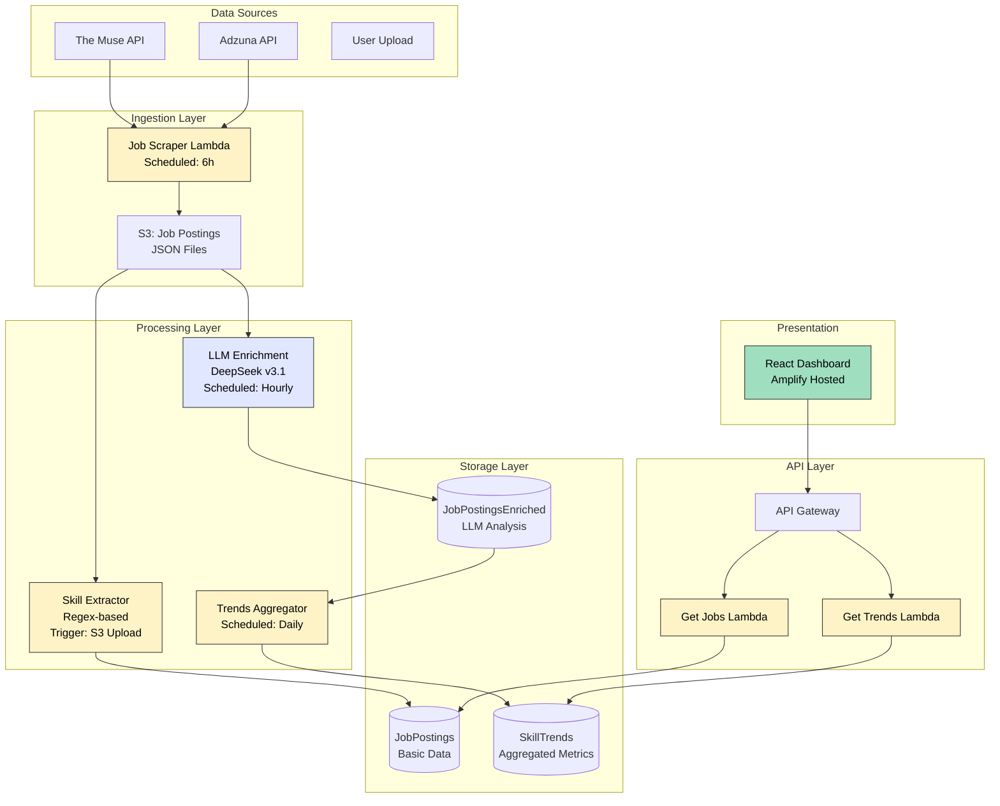
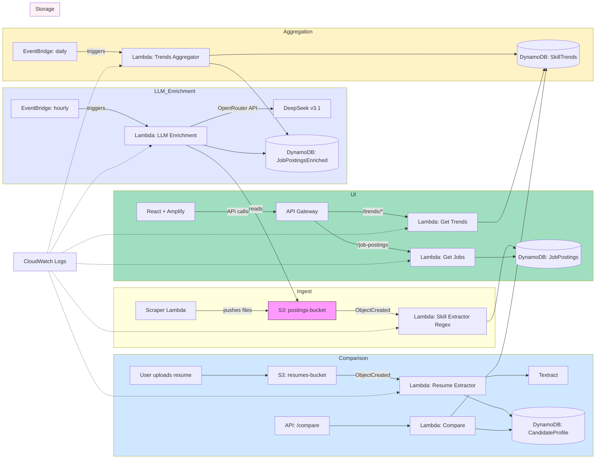
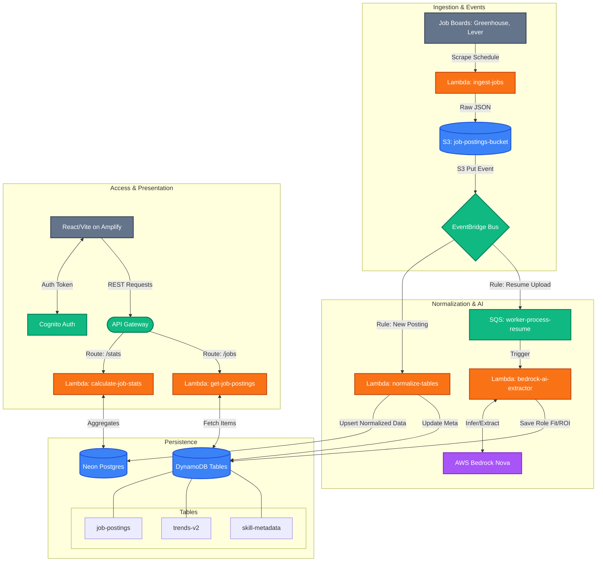

# Job Market Analyzer

This repository contains a small set of Node.js Lambda functions (in `lambda/`) and a React frontend used to analyze job postings and extract skills. The project is organized to be friendly for CI/CD and production packaging.

## Key components

- `lambda/` - One or more AWS Lambda function folders. Each contains a TypeScript source tree that builds to `dist/` and packaging scripts.
- `frontend/` - React + Vite frontend (TypeScript + Tailwind + shadcn components).
- `zip.js` - Root-level packaging script that zips up a target lambda folder into `lambda.zip` using `archiver` installed at the repository root. Designed to avoid installing `archiver` in every lambda folder.

> Current state: Phase 1 completed (packaging centralization, .gitignore cleanup, per-lambda archiver removal). The frontend UI visual polish work is in progress (see roadmap).

## What was done in Phase 1

- Added a root-level `zip.js` (CommonJS) that packages a target lambda directory (dist, node_modules, package.json) into `lambda.zip` in that target folder.
- Installed `archiver` at the repository root so packaging tooling is available centrally.
- Removed `archiver` from the per-lambda `devDependencies` and updated per-lambda `package` scripts to call the root script (`node ../../zip.js .`).
- Replaced lambda-local `zip.js` files (where present) with small shims that delegate to the root-level `zip.js` script.
- Updated `.gitignore` to ignore `**/*.zip`, `**/node_modules/`, `**/dist/`, and `**/package-lock.json` recursively.

This reduces per-lambda duplication and keeps packaging logic centralized for easier maintenance and consistent outputs.

## How to package a single lambda (local)

1. Build inside the lambda folder (or from the repo root via npm workspaces/commands):

```bash
# from within a lambda folder (e.g. lambda/get-job-postings)
npm run build
# then package using the root script (per-lambda package scripts are updated to do this):
npm run package
# or call the root packer directly from repo root:
node zip.js lambda/get-job-postings
```

2. A `lambda.zip` will be created inside the target lambda folder. `./.gitignore` is set to ignore zip files.

## How to package all lambdas (optional)

You can script this in CI or locally. A simple node or bash script can iterate `lambda/*` and call the root `zip.js` for each directory.

Example (bash):

```bash
for d in lambda/*; do
  if [ -d "$d" ]; then
    node ./zip.js "$d"
  fi
done
```

The repository includes `scripts/packageLambdas.js` which demonstrates packaging a selection of lambdas by calling `node zip.js lambda/<name>`.

## Lambdas included in this repository

The current `lambda/` directory contains the following function folders (each generally includes `src/`, `package.json`, and build scripts):

- `aggregate-skill-trends`
- `bedrock-ai-extractor`
- `calculate-job-stats`
- `clean-jobs-bucket`
- `compare-resume-id`
- `get-job-postings`
- `get-job-postings-paginated`
- `get-job-postings-stats`
- `get-skill-trends`
- `job-posting-aggregator`
- `resume-presigned-url`
- `skill-extractor-ai`

Refer to each lambda's `package.json` for the exact `build` and `package` commands used by that function.

## Recommended repo layout and conventions

- Each lambda folder structure:
  - `src/` TypeScript sources
  - `dist/` generated JS after build
  - `package.json` with `build` and `package` scripts
  - `node_modules/` produced locally during build (ignored by git)
- Centralized packaging via root `zip.js` that inspects `dist/`, `node_modules/`, and `package.json` in the target folder and creates `lambda.zip`.

## CI / CD recommendations

- Centralize packaging step in CI (GitHub Actions example):

  - Checkout repository
  - Setup Node
  - For each lambda: npm ci --prefix <lambda>, npm run build --prefix <lambda>, node ./zip.js <lambda>
  - Upload the resulting `lambda.zip` as a release artifact or push to S3

  * Use a CD job to deploy via AWS CLI or SDK (e.g., `aws lambda update-function-code --function-name <name> --zip-file fileb://lambda.zip`)

- Use `npm ci` (not `npm install`) in CI for deterministic installs.
- Prefer keeping `archiver` as a devDependency only at the top-level repository (we installed it at the root). If you switch to pnpm or yarn workspaces, adapt accordingly.

## Security and reproducibility

- Do not check commit or include private keys or AWS credentials in the repo. Use Secrets in CI.
- Use `npm ci` and lockfiles (`package-lock.json` or `pnpm-lock.yaml`) for reproducible builds. We currently ignore nested `package-lock.json` files in `.gitignore` to avoid committing generated lockfiles from nested installs — consider moving to monorepo tooling (workspaces) for multi-package consistency.

## Roadmap / Phase 2 (recommended next work)

- Frontend polish & visual QA: finalize filter alignment, responsiveness, and accessibility (focus states). (In progress)
- Convert packaging to a small Node-based `pack-all` script and optionally integrate with a monorepo tool (pnpm/yarn workspaces) for consistent dependency management.
- Implement a GitHub Actions workflow that: runs tests, builds frontend, packages lambdas, uploads artifacts, and optionally deploys to a staging AWS account.
- (Optional) Migrate repository to ESM (`"type": "module"`) and convert Node scripts to ESM if desired — this is a broader change and should be planned.

## How to test locally (quick checklist)

- Build and package a lambda:
  - cd lambda/<name>
  - npm ci
  - npm run build
  - npm run package # invokes root zip.js
- Run frontend dev server:
  - cd frontend
  - npm install
  - npm run dev

## Frontend (React + Vite)

The frontend is a TypeScript React app built with Vite and Tailwind. It lives in `frontend/` and exposes a small dashboard for exploring job market trends, top technologies, job postings, and a resume upload analyzer.

Key pages (routes):

- `/` — Home landing page with quick stats and CTAs (`src/App.tsx`, `src/pages/Home.tsx`).
- `/trends` — Trends explorer with a left-hand skill list and an insights panel (charts, co-occurrence, trend history). (`src/pages/Trends.tsx`, `src/components/trends/*`).
- `/top-tech` — Simple visual list / bars of top technologies (`src/pages/TopTech.tsx`, `src/components/topTech/TopTechChart.tsx`).
- `/postings` — Job postings viewer and paginated posting list (`src/pages/Postings.tsx`, components under `src/components/postings`).
- `/resume` — Upload a resume (PDF/DOCX), get an AI-powered analysis and suggestions (`src/pages/UploadResume.tsx`, `src/components/resume/ResumeUploader.tsx`, `src/services/resumeService.ts`).

Frontend features discovered:

- Trends list + detail panel: fetches top skills and skill detail from `/trends` endpoints; includes sparkline/line charts, co-occurrence bar charts, CSV export and clipboard copy.
- Top Tech view: renders most in-demand technologies with animated bars and SVG badges.
- Job Postings: robust parsing of backend responses with helpers for messy shapes; supports paginated fetch (`getJobPostingsPage`).
- Resume upload: drag & drop or file picker; client-side validation (PDF/DOCX, max 10MB); uploads call `resumeService` which talks to backend/Amplify for direct S3 upload and analysis; UI shows progress, result summary, downloadable JSON, and copy-to-clipboard.
- React Query is used throughout for data fetching and caching (`@tanstack/react-query`).
- Charts use `recharts` and animations via `framer-motion`.
- Test helpers: a ResizeObserver mock and helpers are included to make Recharts work in jsdom tests (see `frontend/README.md` and `src/test-utils/resize.ts`).

Environment variables

- `VITE_API_URL` — Base URL for the deployed API Gateway (must include stage, e.g. `https://.../prod`). The frontend constructs requests to routes like `${VITE_API_URL}/trends/technology` or `${VITE_API_URL}/job-postings`.

How to run (frontend)

1. Install deps and start dev server:

```bash
cd frontend
npm install
npm run dev
```

2. Build for production:

```bash
cd frontend
npm run build
```

3. Tests and e2e:

- Unit tests (vitest):

```bash
cd frontend
npm run test        # interactive
npm run test:run    # run and exit
npm run test:coverage
```

- E2E / screenshots: Playwright scripts are in `frontend/e2e/`.
  - `npm run e2e:screens` will run the `e2e/trends.run.mjs` screenshot runner.
  - `npm run e2e:with-dev` runs a helper `run-with-dev.js` that starts the dev server and runs tests.

Important files and where to look for features

- `frontend/src/services/trendsService.ts` — API client + normalization for trends endpoints.
- `frontend/src/services/jobStatsService.ts` — consolidates stats used on the homepage and Top Tech view.
- `frontend/src/components/trends/*` — Skill list, SkillCard, SkillDetailPanel (charts, CSV export, copy).
- `frontend/src/components/topTech/TopTechChart.tsx` — Top technologies UI.
- `frontend/src/components/resume/ResumeUploader.tsx` — Resume upload UI and integration with `resumeService`.
- `frontend/src/components/postings/UpdatedJobsPostings.tsx` — Job postings list UI.

Notes and recommendations

- The frontend expects the API to return either raw arrays or Lambda-proxy shaped responses. The services include helpers to normalize both shapes.
- Keep `VITE_API_URL` configured in `frontend/.env` during local development to point at a staging or mocked API.
- The repository includes a `frontend/dist/` folder (likely built output); you may want to remove that from source control if it was committed by accident.

## Questions & notes for PR reviewers

- We intentionally installed `archiver` at the repo root to centralize packaging. I removed `archiver` from lambda `devDependencies`. If any lambda needs to run packaging isolated (no repo root), it will need archiver installed locally — which is not recommended for duplication.

---

## Architecture (target / completed system)

The diagram below shows the intended production architecture for the _completed_ Job Market Analyzer system (aggregation, resume comparison, scheduled ingestion, and dashboard delivery). This reflects the full design described in `JobMarketAnalyzer.md` and the Phase 1 implementation status noted above.







Notes:

- The diagram intentionally shows the full pipeline: ingestion, extraction (Textract + Comprehend), storage (DynamoDB), aggregation/trends, resume comparison, and the web dashboard.
- API Gateway fronts read/compare Lambdas for the frontend. EventBridge triggers scheduled aggregation.
- Components like CloudFront/Amplify and IAM roles, KMS keys, and VPC placement (if needed) are implied; include them in infra IaC as required.

## Repository tree (high-level)

This tree shows how the code maps to the architecture above. It represents the intended, completed layout (phase-complete):

```
job-market-analyzer
├── README.md
├── api
│   ├── http-api
│   │   ├── samconfig.toml
│   │   └── template.yaml
│   ├── rest-api
│   │   ├── samconfig.toml
│   │   └── template.yaml
│   └── sqs-jobs-api
│       ├── samconfig.toml
│       └── template.yaml
├── frontend
│   ├── README.md
│   ├── components.json
│   ├── e2e
│   │   ├── lighthouse-all.js
│   │   ├── run-with-dev.js
│   │   ├── screenshot-all.js
│   │   ├── trends.run.mjs
│   │   └── trends.spec.mjs
│   ├── eslint.config.js
│   ├── index.html
│   ├── package.json
│   ├── screenshots
│   ├── scripts
│   │   ├── screenshot.js
│   │   └── trends-parse-test.mjs
│   ├── src
│   │   ├── App.tsx
│   │   ├── components
│   │   │   ├── AnimatedCounter.tsx
│   │   │   ├── Footer.tsx
│   │   │   ├── Header.tsx
│   │   │   ├── HeaderAlt.tsx
│   │   │   ├── Layout.tsx
│   │   │   ├── MobileNav.tsx
│   │   │   ├── Nav.tsx
│   │   │   ├── ParticleBackground.tsx
│   │   │   ├── Seo.tsx
│   │   │   ├── ThemeProvider.tsx
│   │   │   ├── TrendsLayout.tsx
│   │   │   ├── TrendsMobileLayout.tsx
│   │   │   ├── about
│   │   │   │   ├── FeatureCard.tsx
│   │   │   │   ├── FeatureHero.tsx
│   │   │   │   ├── PipelineTimeline.tsx
│   │   │   │   ├── RoadmapGrid.tsx
│   │   │   │   ├── SectionCard.tsx
│   │   │   │   └── StackPanel.tsx
│   │   │   ├── auth
│   │   │   │   └── ForgotPassword.tsx
│   │   │   ├── landing
│   │   │   │   ├── LandingCTA.tsx
│   │   │   │   ├── LandingHero.tsx
│   │   │   │   └── LandingPage.tsx
│   │   │   ├── login
│   │   │   │   └── LoginForm.tsx
│   │   │   ├── postings
│   │   │   │   ├── CompanyBadgeSvgr.tsx
│   │   │   │   ├── JobPostingCard.tsx
│   │   │   │   ├── JobPostingsControls.tsx
│   │   │   │   ├── JobPostingsSection.tsx
│   │   │   │   ├── MetaPillContainer.tsx
│   │   │   │   ├── TechBadge.tsx
│   │   │   │   ├── TechBadgeSvgr.tsx
│   │   │   │   ├── TechSearchCombobox.tsx
│   │   │   │   ├── UpdatedJobsPostings.tsx
│   │   │   │   └── __tests__
│   │   │   │       ├── JobPostingCard.test.tsx
│   │   │   │       ├── JobPostingsControls.test.tsx
│   │   │   │       └── TechSearchCombobox.test.tsx
│   │   │   ├── register
│   │   │   │   └── RegisterForm.tsx
│   │   │   ├── resumes
│   │   │   │   ├── ResumeExperience.tsx
│   │   │   │   ├── ResumeInsights.tsx
│   │   │   │   ├── ResumeSummary.tsx
│   │   │   │   ├── ResumeTechnologies.tsx
│   │   │   │   ├── ResumeUploader.tsx
│   │   │   │   ├── ResumeUploaderV2.tsx
│   │   │   │   └── manageResumes
│   │   │   │       ├── ManageResumes.tsx
│   │   │   │       └── ResumeCard.tsx
│   │   │   ├── shared
│   │   │   │   ├── AuthCard.tsx
│   │   │   │   ├── MotionDraw.tsx
│   │   │   │   ├── MotionLogo.tsx
│   │   │   │   ├── ProtectedRoute.tsx
│   │   │   │   ├── StatsCard.tsx
│   │   │   │   └── logos.ts
│   │   │   ├── topTech
│   │   │   │   └── TopTechChart.tsx
│   │   │   ├── trends
│   │   │   │   ├── SkillCard.test.tsx
│   │   │   │   ├── SkillCard.tsx
│   │   │   │   ├── SkillCardAlt.tsx
│   │   │   │   ├── SkillDetailPanel.test.tsx
│   │   │   │   ├── SkillDetailPanel.tsx
│   │   │   │   ├── SkillList.test.tsx
│   │   │   │   ├── SkillList.tsx
│   │   │   │   ├── SkillListOld.tsx
│   │   │   │   └── trends.test.ts
│   │   │   ├── trends-v2
│   │   │   │   ├── CellCard.tsx
│   │   │   │   ├── CooccurringChart.tsx
│   │   │   │   ├── FiltersBar.tsx
│   │   │   │   ├── RisingGrid.tsx
│   │   │   │   ├── TechCard.tsx
│   │   │   │   ├── TechDetailPanel.tsx
│   │   │   │   ├── TopList.tsx
│   │   │   │   └── TrendsV2Controls.tsx
│   │   │   └── ui
│   │   │       ├── accordion.tsx
│   │   │       ├── badge.tsx
│   │   │       ├── button.tsx
│   │   │       ├── card.tsx
│   │   │       ├── checkbox.tsx
│   │   │       ├── collapsible.tsx
│   │   │       ├── command.tsx
│   │   │       ├── dialog.tsx
│   │   │       ├── dropdown-menu.tsx
│   │   │       ├── field.tsx
│   │   │       ├── input.tsx
│   │   │       ├── label.tsx
│   │   │       ├── pagination.tsx
│   │   │       ├── popover.tsx
│   │   │       ├── progress.tsx
│   │   │       ├── scroll-area.tsx
│   │   │       ├── select.tsx
│   │   │       ├── separator.tsx
│   │   │       ├── sheet.tsx
│   │   │       ├── sidebar.tsx
│   │   │       ├── skeleton.tsx
│   │   │       ├── spinner.tsx
│   │   │       ├── tabs.tsx
│   │   │       ├── tooltip.tsx
│   │   │       └── typography.tsx
│   │   ├── contexts
│   │   │   ├── AuthContext.tsx
│   │   │   └── ThemeContext.tsx
│   │   ├── hooks
│   │   │   ├── use-mobile.ts
│   │   │   ├── useAuthInitialization.ts
│   │   │   ├── useDebouncedCallback.ts
│   │   │   ├── useIsMobile.ts
│   │   │   ├── useTheme.ts
│   │   │   └── useTrendsV2Data.ts
│   │   ├── index.css
│   │   ├── lib
│   │   │   ├── postingsBadgeHelpers.ts
│   │   │   ├── stringHelpers.ts
│   │   │   ├── trends.ts
│   │   │   ├── utils
│   │   │   │   ├── __tests__
│   │   │   │   │   └── techBadgeHelpers.test.ts
│   │   │   │   ├── companyHelpers.ts
│   │   │   │   ├── dateUtils.ts
│   │   │   │   ├── experienceDuration.ts
│   │   │   │   └── techBadgeHelpers.ts
│   │   │   └── utils.ts
│   │   ├── main.tsx
│   │   ├── pages
│   │   │   ├── About.tsx
│   │   │   ├── ForgotPassword.tsx
│   │   │   ├── Home.tsx
│   │   │   ├── JobDetail.tsx
│   │   │   ├── JobPostingDetail.tsx
│   │   │   ├── Login.tsx
│   │   │   ├── ManageResumes.tsx
│   │   │   ├── Postings.tsx
│   │   │   ├── Register.tsx
│   │   │   ├── TopTech.tsx
│   │   │   ├── Trends.tsx
│   │   │   ├── TrendsV2.tsx
│   │   │   ├── UploadResume.tsx
│   │   │   └── VerifyEmail.tsx
│   │   ├── services
│   │   │   ├── __tests__
│   │   │   │   ├── authService.test.ts
│   │   │   │   ├── jobPostingsNeonService.test.ts
│   │   │   │   ├── jobPostingsService.test.ts
│   │   │   │   ├── jobStatsService.test.ts
│   │   │   │   ├── resumeService.test.ts
│   │   │   │   ├── trendsService.test.ts
│   │   │   │   └── trendsv2Service.test.ts
│   │   │   ├── authService.ts
│   │   │   ├── jobPostingsNeonService.ts
│   │   │   ├── jobPostingsService.ts
│   │   │   ├── jobStatsService.ts
│   │   │   ├── resumeService.ts
│   │   │   ├── trendsService.ts
│   │   │   └── trendsv2Service.ts
│   │   ├── setupTests.ts
│   │   ├── stores
│   │   │   ├── authStore.ts
│   │   │   └── useJobPostingsStore.ts
│   │   ├── styles
│   │   │   ├── App.css
│   │   │   ├── JobPostingCard.css
│   │   │   ├── ParticleBackground.css
│   │   │   ├── auth.css
│   │   │   ├── cta.css
│   │   │   ├── feature-cards.css
│   │   │   ├── general.css
│   │   │   ├── icon-svg.css
│   │   │   ├── job-postings.css
│   │   │   ├── landing.css
│   │   │   ├── list-bullets.css
│   │   │   ├── mobile-insights.css
│   │   │   ├── nav.css
│   │   │   ├── pagination.css
│   │   │   ├── remote-pill.css
│   │   │   ├── responsive-fixes.css
│   │   │   ├── resume.css
│   │   │   ├── section-card.css
│   │   │   ├── stats-cards.css
│   │   │   ├── tech-bar.css
│   │   │   ├── tech-chart.css
│   │   │   ├── tokens.css
│   │   │   ├── trends.css
│   │   │   └── typography.css
│   │   ├── test-typings.d.ts
│   │   ├── test-utils
│   │   │   └── resize.ts
│   │   └── types
│   │       └── mermaid.d.ts
│   ├── tests
│   │   └── about.test.tsx
│   ├── tsconfig.app.json
│   ├── tsconfig.json
│   ├── tsconfig.node.json
│   ├── vite.config.ts
│   └── vitest.config.ts
├── lambda
│   ├── aggregate-skill-trends-v2
│   │   ├── aggregate-skill-trends-v2.zip
│   │   ├── lambda.zip
│   │   ├── package-lock.json
│   │   ├── package.json
│   │   ├── src
│   │   │   ├── compute
│   │   │   │   ├── buckets.ts
│   │   │   │   ├── momentum.ts
│   │   │   │   └── stats.ts
│   │   │   ├── ddb.ts
│   │   │   ├── index.ts
│   │   │   ├── lib
│   │   │   │   └── salaryAnchors.ts
│   │   │   └── normalizers
│   │   │       ├── location.ts
│   │   │       ├── salary.ts
│   │   │       └── skills.ts
│   │   ├── tsconfig.json
│   │   └── tsup.config.ts
│   ├── auth
│   │   ├── auth-forgot-password
│   │   │   ├── auth-forgot-password.zip
│   │   │   ├── package-lock.json
│   │   │   ├── package.json
│   │   │   ├── src
│   │   │   │   └── index.ts
│   │   │   ├── tsconfig.json
│   │   │   └── tsup.config.ts
│   │   ├── auth-get-current-user
│   │   │   ├── auth-get-current-user.zip
│   │   │   ├── lambda.zip
│   │   │   ├── package-lock.json
│   │   │   ├── package.json
│   │   │   ├── src
│   │   │   │   └── index.ts
│   │   │   ├── tsconfig.json
│   │   │   └── tsup.config.ts
│   │   ├── auth-login
│   │   │   ├── auth-login.zip
│   │   │   ├── lambda.zip
│   │   │   ├── package-lock.json
│   │   │   ├── package.json
│   │   │   ├── src
│   │   │   │   └── index.ts
│   │   │   ├── tsconfig.json
│   │   │   └── tsup.config.ts
│   │   ├── auth-logout
│   │   │   ├── auth-logout.zip
│   │   │   ├── lambda.zip
│   │   │   ├── package-lock.json
│   │   │   ├── package.json
│   │   │   ├── src
│   │   │   │   └── index.ts
│   │   │   ├── tsconfig.json
│   │   │   └── tsup.config.ts
│   │   ├── auth-register
│   │   │   ├── auth-register.zip
│   │   │   ├── lambda.zip
│   │   │   ├── package-lock.json
│   │   │   ├── package.json
│   │   │   ├── src
│   │   │   │   └── index.ts
│   │   │   ├── tsconfig.json
│   │   │   └── tsup.config.ts
│   │   ├── auth-reset-password
│   │   │   ├── auth-reset-password.zip
│   │   │   ├── package-lock.json
│   │   │   ├── package.json
│   │   │   ├── src
│   │   │   │   └── index.ts
│   │   │   ├── tsconfig.json
│   │   │   └── tsup.config.ts
│   │   └── auth-verify-email
│   │       ├── auth-verify-email.zip
│   │       ├── lambda.zip
│   │       ├── package-lock.json
│   │       ├── package.json
│   │       ├── src
│   │       │   └── index.ts
│   │       ├── tsconfig.json
│   │       └── tsup.config.ts
│   ├── calculate-job-stats
│   │   ├── calculate-job-stats.zip
│   │   ├── package-lock.json
│   │   ├── package.json
│   │   ├── src
│   │   │   └── index.ts
│   │   ├── tsconfig.json
│   │   └── tsup.config.ts
│   ├── cognito-post-confirmation
│   │   ├── cognito-post-confirmation.zip
│   │   ├── lambda.zip
│   │   ├── package-lock.json
│   │   ├── package.json
│   │   ├── src
│   │   │   └── index.ts
│   │   ├── tsconfig.json
│   │   └── tsup.config.ts
│   ├── compare-resume-id
│   │   ├── compare-resume-id.zip
│   │   ├── lambda.zip
│   │   ├── old-compare-lambda.zip
│   │   ├── package-lock.json
│   │   ├── package.json
│   │   ├── src
│   │   │   ├── cors.ts
│   │   │   ├── index.ts
│   │   │   └── preflight.ts
│   │   ├── tsconfig.json
│   │   └── tsup.config.ts
│   ├── get-job-postings-paginated
│   │   ├── get-job-postings-paginated.zip
│   │   ├── lambda.zip
│   │   ├── package-lock.json
│   │   ├── package.json
│   │   ├── src
│   │   │   ├── index.ts
│   │   │   └── utils.ts
│   │   ├── tsconfig.json
│   │   └── tsup.config.ts
│   ├── get-job-postings-paginated-neon
│   │   ├── package-lock.json
│   │   ├── package.json
│   │   ├── src
│   │   │   └── index.ts
│   │   ├── tsconfig.json
│   │   └── tsup.config.ts
│   ├── get-job-postings-stats
│   │   ├── get-job-postings-stats.zip
│   │   ├── lambda.zip
│   │   ├── package-lock.json
│   │   ├── package.json
│   │   ├── src
│   │   │   └── index.ts
│   │   ├── tsconfig.json
│   │   └── tsup.config.ts
│   ├── get-job-processing-status
│   │   ├── get-job-processing-status.zip
│   │   ├── lambda.zip
│   │   ├── package-lock.json
│   │   ├── package.json
│   │   ├── src
│   │   │   ├── cors.ts
│   │   │   ├── index.ts
│   │   │   └── preflight.ts
│   │   ├── tsconfig.json
│   │   └── tsup.config.ts
│   ├── get-trends-v2
│   │   ├── get-trends-v2.zip
│   │   ├── lambda.zip
│   │   ├── package-lock.json
│   │   ├── package.json
│   │   ├── src
│   │   │   ├── index.ts
│   │   │   ├── logging.ts
│   │   │   ├── pivot.ts
│   │   │   └── utils.ts
│   │   ├── tsconfig.json
│   │   └── tsup.config.ts
│   ├── get-user-resumes
│   │   ├── get-user-resumes.zip
│   │   ├── lambda.zip
│   │   ├── package-lock.json
│   │   ├── package.json
│   │   ├── src
│   │   │   ├── cors.ts
│   │   │   ├── index.ts
│   │   │   └── utils.ts
│   │   ├── tsconfig.json
│   │   └── tsup.config.ts
│   ├── ingest-jobs
│   │   ├── README.md
│   │   ├── ingest-jobs-11-10-25_17-20.zip
│   │   ├── ingest-jobs.zip
│   │   ├── job-market-analyzer-types-0.1.0.tgz
│   │   ├── lambda.zip
│   │   ├── package-lock.json
│   │   ├── package.json
│   │   ├── samconfig.toml
│   │   ├── src
│   │   │   ├── adapters
│   │   │   │   ├── greenhouse.ts
│   │   │   │   ├── index.ts
│   │   │   │   ├── lever.ts
│   │   │   │   ├── muse.ts
│   │   │   │   ├── types.ts
│   │   │   │   └── usajobs.ts
│   │   │   ├── company-slugs.json
│   │   │   ├── find-slugs.md
│   │   │   ├── index.ts
│   │   │   ├── lib
│   │   │   │   ├── dateHelpers.ts
│   │   │   │   ├── dedupe.test.ts
│   │   │   │   ├── dedupe.ts
│   │   │   │   ├── devFilter.ts
│   │   │   │   ├── runAdapters.ts
│   │   │   │   └── upsert.ts
│   │   │   └── scripts
│   │   │       ├── discover-lever.ts
│   │   │       ├── find-boards.ts
│   │   │       └── smoke.ts
│   │   ├── template.yaml
│   │   ├── tsconfig.json
│   │   └── tsup.config.ts
│   ├── normalize-tables
│   │   ├── normalize-tables.zip
│   │   ├── package-lock.json
│   │   ├── package.json
│   │   ├── src
│   │   │   ├── companiesMap.ts
│   │   │   ├── config.ts
│   │   │   ├── dynamoService.ts
│   │   │   ├── index.ts
│   │   │   ├── neonService.ts
│   │   │   ├── normalizer.ts
│   │   │   ├── types.ts
│   │   │   └── utils.ts
│   │   ├── tsconfig.json
│   │   └── tsup.config.ts
│   ├── openrouter-ai-enhancement-from-table
│   │   ├── openRouterModels
│   │   │   ├── README.md
│   │   │   ├── deepseek-chat-v3.1.json
│   │   │   ├── gemini-2.0-flash-exp.json
│   │   │   ├── gpt-oss-20b.json
│   │   │   ├── kat-coder-pro.json
│   │   │   ├── llama-3.3-70b-instruct.json
│   │   │   ├── llama-4-maverick.json
│   │   │   ├── llama-4-scout.json
│   │   │   ├── qwen-2.5-72b-instruct.json
│   │   │   └── qwen3-coder.json
│   │   ├── openrouter-ai-enhancement-from-table.zip
│   │   ├── package-lock.json
│   │   ├── package.json
│   │   ├── src
│   │   │   ├── aiService.ts
│   │   │   ├── dbService.ts
│   │   │   ├── index.ts
│   │   │   ├── keyHelper.ts
│   │   │   ├── keyManagement.ts
│   │   │   ├── logging.ts
│   │   │   ├── tokenLogger.ts
│   │   │   ├── types.ts
│   │   │   └── utils.ts
│   │   ├── tsconfig.json
│   │   └── tsup.config.ts
│   ├── resume-presigned-url
│   │   ├── lambda.zip
│   │   ├── package-lock.json
│   │   ├── package.json
│   │   ├── resume-presigned-url.zip
│   │   ├── src
│   │   │   ├── dynamoService.ts
│   │   │   └── index.ts
│   │   ├── tsconfig.json
│   │   └── tsup.config.ts
│   └── worker-process-resume
│       ├── package-lock.json
│       ├── package.json
│       ├── src
│       │   ├── aiService.ts
│       │   ├── arrayHelpers.ts
│       │   ├── bedrockTokenLogger.ts
│       │   ├── calibrator.ts
│       │   ├── cors.ts
│       │   ├── dateHelpers.ts
│       │   ├── dbService.ts
│       │   ├── docx.ts
│       │   ├── extractors.ts
│       │   ├── fileHelpers.ts
│       │   ├── fileProcessor.ts
│       │   ├── index.ts
│       │   ├── logging.ts
│       │   ├── preflight.ts
│       │   ├── s3Service.ts
│       │   ├── sanitizers.ts
│       │   ├── techNormalizer.ts
│       │   ├── techTrends.ts
│       │   ├── techTrendsDbService.ts
│       │   ├── techTrendsHelpers.ts
│       │   ├── tokenLogger.ts
│       │   ├── types.ts
│       │   └── utils.ts
│       ├── tsconfig.json
│       ├── tsup.config.ts
│       └── worker-process-resume.zip
├── package-lock.json
├── package.json
├── packages
│   └── shared-types
│       ├── job-market-analyzer-types-0.1.0.tgz
│       ├── package.json
│       ├── src
│       │   ├── auth.ts
│       │   ├── canonical-job.ts
│       │   ├── index.ts
│       │   ├── jobs.ts
│       │   ├── lambda.ts
│       │   ├── resume-query.ts
│       │   ├── resume-record.ts
│       │   ├── resume.ts
│       │   ├── trends.ts
│       │   └── trendsv2.ts
│       └── tsconfig.json
├── portfolio
├── scripts
│   ├── backfill-processed-day.ts
│   ├── buildLambdas.js
│   ├── delete-jobs.ts
│   ├── backfill-processed-day.ts
│   ├── buildLambdas.js
│   ├── backfill-processed-day.ts
│   ├── backfill-processed-day.ts
│   ├── backfill-processed-day.ts
│   ├── buildLambdas.js
│   ├── delete-jobs.ts
│   ├── fix-remote-status.ts
│   ├── fix-skill-canonical-lowercase.ts
│   ├── job-tech-index.py
│   ├── jtindex.py
│   ├── migrate-job-board-source-to-neon.ts
│   ├── migrate-job-board-source.ts
│   ├── migrate-source-url-to-neon.ts
│   ├── migrate-source-url.ts
│   ├── packageLambdas.js
│   ├── playwright
│   ├── reconcile-skill-display-and-dupes.ts
│   ├── skillsandtech.py
│   └── status.py
└── zip.js
```

Mapping notes:

- `lambda/*/src` implements the Lambdas shown in the diagram (ingest, aggregator, resume extractor, read APIs).
- `frontend/` is the React dashboard served through Amplify or CloudFront.
- `zip.js` is the centralized packer used by per-lambda `package` scripts.
