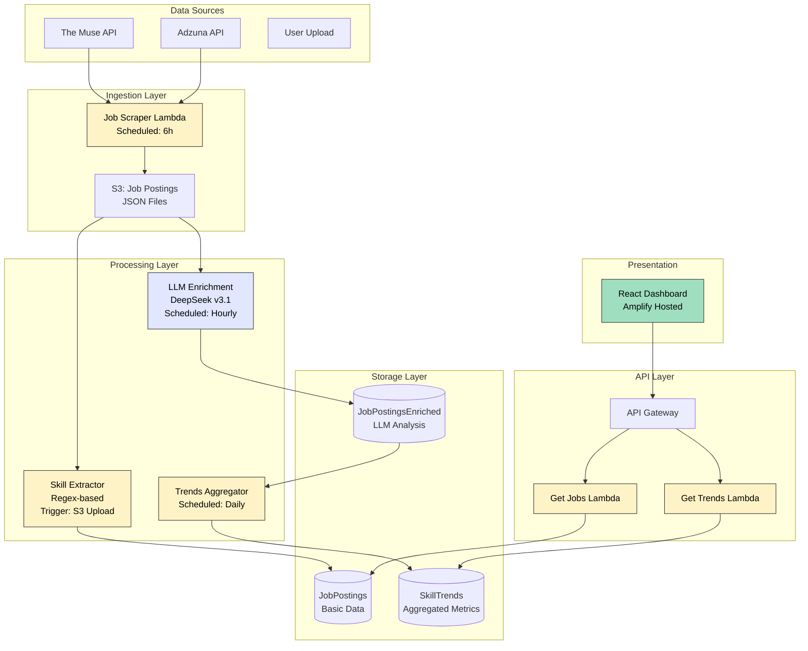
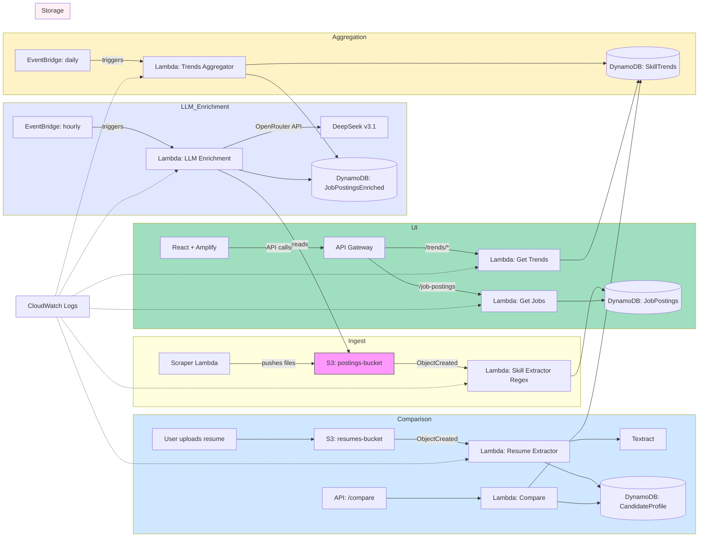

# Job Market Analyzer

This repository contains a small set of Node.js Lambda functions and a React frontend used to analyze job postings and extract skills. The project is organized to be friendly for CI/CD and production packaging.

# Job Market Analyzer

This repository contains a small set of Node.js Lambda functions and a React frontend used to analyze job postings and extract skills. The project is organized to be friendly for CI/CD and production packaging.

## Key components

- `lambda-functions/` - One or more AWS Lambda function folders. Each contains a TypeScript source tree that builds to `dist/` and packaging scripts.
- `frontend/` - React + Vite frontend (TypeScript + Tailwind + shadcn components).
- `zip.js` - Root-level packaging script that zips up a target lambda folder into `lambda.zip` using `archiver` installed at the repository root. Designed to avoid installing `archiver` in every lambda folder.

> Current state: Phase 1 completed (packaging centralization, .gitignore cleanup, per-lambda archiver removal). The frontend UI visual polish work is in progress (see roadmap).

## What was done in Phase 1

- Added a root-level `zip.js` (CommonJS) that packages a target lambda directory (dist, node_modules, package.json) into `lambda.zip` in that target folder.
- Installed `archiver` at the repository root so packaging tooling is available centrally.
- Removed `archiver` from the per-lambda `devDependencies` and updated per-lambda `package` scripts to call the root script (`node ../../zip.js .`).
- Replaced lambda-local `zip.js` files (where present) with small shims that delegate to the root-level `zip.js`.
- Updated `.gitignore` to ignore `**/*.zip`, `**/node_modules/`, `**/dist/`, and `**/package-lock.json` recursively.

This reduces per-lambda duplication and keeps packaging logic centralized for easier maintenance and consistent outputs.

## How to package a single lambda (local)

1. Build inside the lambda folder (or from the repo root via npm workspaces/commands):

```bash
# from within a lambda folder (e.g. lambda-functions/get-job-postings)
npm run build
# then package using the root script (per-lambda package scripts are updated to do this):
npm run package
# or call the root packer directly from repo root:
node zip.js lambda-functions/get-job-postings
```

2. A `lambda.zip` will be created inside the target lambda folder. `./.gitignore` is set to ignore zip files.

## How to package all lambdas (optional)

You can script this in CI or locally. A simple node or bash script can iterate `lambda-functions/*` and call the root `zip.js` for each directory.

Example (bash):

```bash
for d in lambda-functions/*; do
  if [ -d "$d" ]; then
    node ./zip.js "$d"
  fi
done
```

I can add a `scripts/pack-all.js` file if you want a cross-platform Node script that does this for you.

## Recommended repo layout and conventions

- Each lambda folder structure:
  - `src/` TypeScript sources
  - `dist/` generated JS after build
  - `package.json` with `build` and `package` scripts
  - `node_modules/` produced locally during build (ignored by git)
- Centralized packaging via root `zip.js` that inspects `dist/`, `node_modules/`, and `package.json` in the target folder and creates `lambda.zip`.

## CI / CD recommendations

- Centralize packaging step in CI (GitHub Actions example):

  - Checkout repository
  - Setup Node
  - For each lambda: npm ci --prefix <lambda>, npm run build --prefix <lambda>, node ./zip.js <lambda>
  - Upload the resulting `lambda.zip` as a release artifact or push to S3

  * Use a CD job to deploy via AWS CLI or SDK (e.g., `aws lambda update-function-code --function-name <name> --zip-file fileb://lambda.zip`)

- Use `npm ci` (not `npm install`) in CI for deterministic installs.
- Prefer keeping `archiver` as a devDependency only at the top-level repository (we installed it at the root). If you switch to pnpm or yarn workspaces, adapt accordingly.

## Security and reproducibility

- Do not check commit or include private keys or AWS credentials in the repo. Use Secrets in CI.
- Use `npm ci` and lockfiles (`package-lock.json` or `pnpm-lock.yaml`) for reproducible builds. We currently ignore nested `package-lock.json` files in `.gitignore` to avoid committing generated lockfiles from nested installs — consider moving to monorepo tooling (workspaces) for multi-package consistency.

## Roadmap / Phase 2 (recommended next work)

- Frontend polish & visual QA: finalize filter alignment, responsiveness, and accessibility (focus states). (In progress)
- Convert packaging to a small Node-based `pack-all` script and optionally integrate with a monorepo tool (pnpm/yarn workspaces) for consistent dependency management.
- Implement a GitHub Actions workflow that: runs tests, builds frontend, packages lambdas, uploads artifacts, and optionally deploys to a staging AWS account.
- (Optional) Migrate repository to ESM (`"type": "module"`) and convert Node scripts to ESM if desired — this is a broader change and should be planned.

## How to test locally (quick checklist)

- Build and package a lambda:
  - cd lambda-functions/<name>
  - npm ci
  - npm run build
  - npm run package # invokes root zip.js
- Run frontend dev server:
  - cd frontend
  - npm install
  - npm run dev

## Questions & notes for PR reviewers

- We intentionally installed `archiver` at the repo root to centralize packaging. I removed `archiver` from lambda `devDependencies`. If any lambda needs to run packaging isolated (no repo root), it will need archiver installed locally — which is not recommended for duplication.

---

## Architecture (target / completed system)

The diagram below shows the intended production architecture for the _completed_ Job Market Analyzer system (aggregation, resume comparison, scheduled ingestion, and dashboard delivery). This reflects the full design described in `JobMarketAnalyzer.md` and the Phase 1 implementation status noted above.





Notes:

- The diagram intentionally shows the full pipeline: ingestion, extraction (Textract + Comprehend), storage (DynamoDB), aggregation/trends, resume comparison, and the web dashboard.
- API Gateway fronts read/compare Lambdas for the frontend. EventBridge triggers scheduled aggregation.
- Components like CloudFront/Amplify and IAM roles, KMS keys, and VPC placement (if needed) are implied; include them in infra IaC as required.

## Repository tree (high-level)

This tree shows how the code maps to the architecture above. It represents the intended, completed layout (phase-complete):

```
/ (repo root)
├─ README.md
├─ JobMarketAnalyzer.md
├─ zip.js                # repo-level packaging script (creates lambda.zip)
├─ package.json          # root devDependencies (archiver, build tooling)
├─ lambda-functions/
│  ├─ get-job-postings/
│  │  ├─ src/            # TypeScript sources for ingestion lambda
│  │  ├─ dist/           # build output (ignored)
│  │  └─ package.json    # scripts: build, package -> node ../../zip.js .
│  ├─ skill-extractor/
│  │  ├─ src/            # extraction logic (Comprehend integration)
│  │  ├─ dist/
│  │  └─ package.json
│  ├─ skill-extractor-algo/
│  │  ├─ src/            # optional alternate algorithmic extractor
│  │  ├─ dist/
│  │  └─ package.json
│  └─ ... other lambdas
├─ frontend/
│  ├─ src/               # React + shadcn components, pages
│  ├─ public/
│  ├─ package.json
│  └─ vite.config.ts
└─ .gitignore
```

Mapping notes:

- `lambda-functions/*/src` implements the Lambdas shown in the diagram (ingest, aggregator, resume extractor, read APIs).
- `frontend/` is the React dashboard served through Amplify or CloudFront.
- `zip.js` is the centralized packer used by per-lambda `package` scripts.
