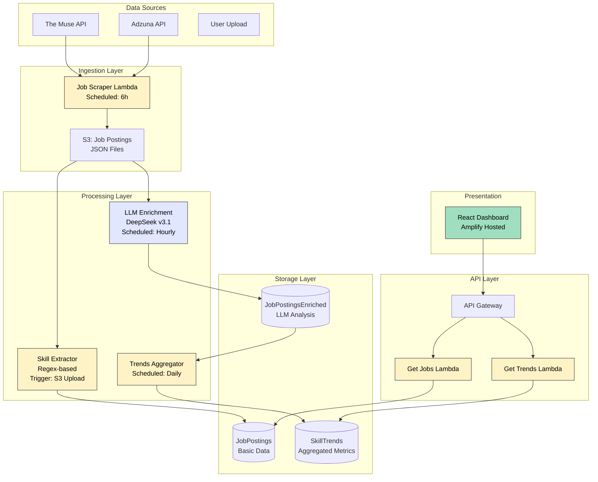
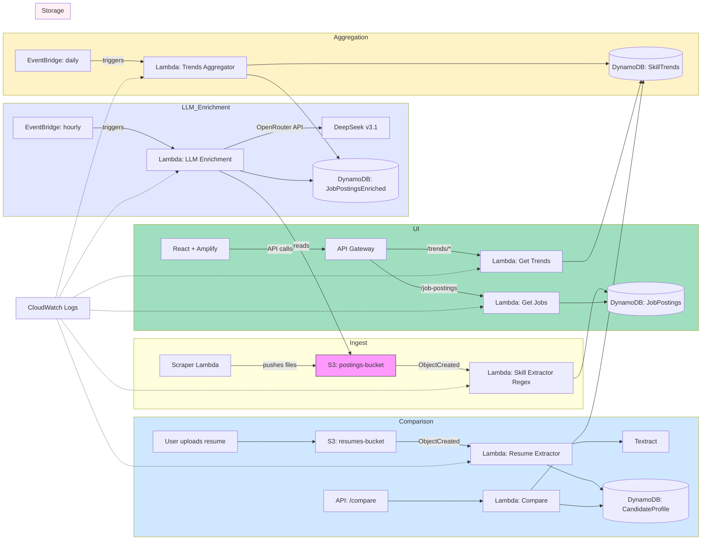

# Job Market Analyzer

This repository contains a small set of Node.js Lambda functions (in `lambda/`) and a React frontend used to analyze job postings and extract skills. The project is organized to be friendly for CI/CD and production packaging.

## Key components

- `lambda/` - One or more AWS Lambda function folders. Each contains a TypeScript source tree that builds to `dist/` and packaging scripts.
- `frontend/` - React + Vite frontend (TypeScript + Tailwind + shadcn components).
- `zip.js` - Root-level packaging script that zips up a target lambda folder into `lambda.zip` using `archiver` installed at the repository root. Designed to avoid installing `archiver` in every lambda folder.

> Current state: Phase 1 completed (packaging centralization, .gitignore cleanup, per-lambda archiver removal). The frontend UI visual polish work is in progress (see roadmap).

## What was done in Phase 1

- Added a root-level `zip.js` (CommonJS) that packages a target lambda directory (dist, node_modules, package.json) into `lambda.zip` in that target folder.
- Installed `archiver` at the repository root so packaging tooling is available centrally.
- Removed `archiver` from the per-lambda `devDependencies` and updated per-lambda `package` scripts to call the root script (`node ../../zip.js .`).
- Replaced lambda-local `zip.js` files (where present) with small shims that delegate to the root-level `zip.js` script.
- Updated `.gitignore` to ignore `**/*.zip`, `**/node_modules/`, `**/dist/`, and `**/package-lock.json` recursively.

This reduces per-lambda duplication and keeps packaging logic centralized for easier maintenance and consistent outputs.

## How to package a single lambda (local)

1. Build inside the lambda folder (or from the repo root via npm workspaces/commands):

```bash
# from within a lambda folder (e.g. lambda/get-job-postings)
npm run build
# then package using the root script (per-lambda package scripts are updated to do this):
npm run package
# or call the root packer directly from repo root:
node zip.js lambda/get-job-postings
```

2. A `lambda.zip` will be created inside the target lambda folder. `./.gitignore` is set to ignore zip files.

## How to package all lambdas (optional)

You can script this in CI or locally. A simple node or bash script can iterate `lambda/*` and call the root `zip.js` for each directory.

Example (bash):

```bash
for d in lambda/*; do
  if [ -d "$d" ]; then
    node ./zip.js "$d"
  fi
done
```

The repository includes `scripts/packageLambdas.js` which demonstrates packaging a selection of lambdas by calling `node zip.js lambda/<name>`.

## Lambdas included in this repository

The current `lambda/` directory contains the following function folders (each generally includes `src/`, `package.json`, and build scripts):

- `aggregate-skill-trends`
- `bedrock-ai-extractor`
- `calculate-job-stats`
- `clean-jobs-bucket`
- `compare-resume-id`
- `get-job-postings`
- `get-job-postings-paginated`
- `get-job-postings-stats`
- `get-skill-trends`
- `job-posting-aggregator`
- `resume-presigned-url`
- `skill-extractor-ai`

Refer to each lambda's `package.json` for the exact `build` and `package` commands used by that function.

## Recommended repo layout and conventions

- Each lambda folder structure:
  - `src/` TypeScript sources
  - `dist/` generated JS after build
  - `package.json` with `build` and `package` scripts
  - `node_modules/` produced locally during build (ignored by git)
- Centralized packaging via root `zip.js` that inspects `dist/`, `node_modules/`, and `package.json` in the target folder and creates `lambda.zip`.

## CI / CD recommendations

- Centralize packaging step in CI (GitHub Actions example):

  - Checkout repository
  - Setup Node
  - For each lambda: npm ci --prefix <lambda>, npm run build --prefix <lambda>, node ./zip.js <lambda>
  - Upload the resulting `lambda.zip` as a release artifact or push to S3

  * Use a CD job to deploy via AWS CLI or SDK (e.g., `aws lambda update-function-code --function-name <name> --zip-file fileb://lambda.zip`)

- Use `npm ci` (not `npm install`) in CI for deterministic installs.
- Prefer keeping `archiver` as a devDependency only at the top-level repository (we installed it at the root). If you switch to pnpm or yarn workspaces, adapt accordingly.

## Security and reproducibility

- Do not check commit or include private keys or AWS credentials in the repo. Use Secrets in CI.
- Use `npm ci` and lockfiles (`package-lock.json` or `pnpm-lock.yaml`) for reproducible builds. We currently ignore nested `package-lock.json` files in `.gitignore` to avoid committing generated lockfiles from nested installs — consider moving to monorepo tooling (workspaces) for multi-package consistency.

## Roadmap / Phase 2 (recommended next work)

- Frontend polish & visual QA: finalize filter alignment, responsiveness, and accessibility (focus states). (In progress)
- Convert packaging to a small Node-based `pack-all` script and optionally integrate with a monorepo tool (pnpm/yarn workspaces) for consistent dependency management.
- Implement a GitHub Actions workflow that: runs tests, builds frontend, packages lambdas, uploads artifacts, and optionally deploys to a staging AWS account.
- (Optional) Migrate repository to ESM (`"type": "module"`) and convert Node scripts to ESM if desired — this is a broader change and should be planned.

## How to test locally (quick checklist)

- Build and package a lambda:
  - cd lambda/<name>
  - npm ci
  - npm run build
  - npm run package # invokes root zip.js
- Run frontend dev server:
  - cd frontend
  - npm install
  - npm run dev

## Frontend (React + Vite)

The frontend is a TypeScript React app built with Vite and Tailwind. It lives in `frontend/` and exposes a small dashboard for exploring job market trends, top technologies, job postings, and a resume upload analyzer.

Key pages (routes):

- `/` — Home landing page with quick stats and CTAs (`src/App.tsx`, `src/pages/Home.tsx`).
- `/trends` — Trends explorer with a left-hand skill list and an insights panel (charts, co-occurrence, trend history). (`src/pages/Trends.tsx`, `src/components/trends/*`).
- `/top-tech` — Simple visual list / bars of top technologies (`src/pages/TopTech.tsx`, `src/components/topTech/TopTechChart.tsx`).
- `/postings` — Job postings viewer and paginated posting list (`src/pages/Postings.tsx`, components under `src/components/postings`).
- `/resume` — Upload a resume (PDF/DOCX), get an AI-powered analysis and suggestions (`src/pages/UploadResume.tsx`, `src/components/resume/ResumeUploader.tsx`, `src/services/resumeService.ts`).

Frontend features discovered:

- Trends list + detail panel: fetches top skills and skill detail from `/trends` endpoints; includes sparkline/line charts, co-occurrence bar charts, CSV export and clipboard copy.
- Top Tech view: renders most in-demand technologies with animated bars and SVG badges.
- Job Postings: robust parsing of backend responses with helpers for messy shapes; supports paginated fetch (`getJobPostingsPage`).
- Resume upload: drag & drop or file picker; client-side validation (PDF/DOCX, max 10MB); uploads call `resumeService` which talks to backend/Amplify for direct S3 upload and analysis; UI shows progress, result summary, downloadable JSON, and copy-to-clipboard.
- React Query is used throughout for data fetching and caching (`@tanstack/react-query`).
- Charts use `recharts` and animations via `framer-motion`.
- Test helpers: a ResizeObserver mock and helpers are included to make Recharts work in jsdom tests (see `frontend/README.md` and `src/test-utils/resize.ts`).

Environment variables

- `VITE_API_URL` — Base URL for the deployed API Gateway (must include stage, e.g. `https://.../prod`). The frontend constructs requests to routes like `${VITE_API_URL}/trends/technology` or `${VITE_API_URL}/job-postings`.

How to run (frontend)

1. Install deps and start dev server:

```bash
cd frontend
npm install
npm run dev
```

2. Build for production:

```bash
cd frontend
npm run build
```

3. Tests and e2e:

- Unit tests (vitest):

```bash
cd frontend
npm run test        # interactive
npm run test:run    # run and exit
npm run test:coverage
```

- E2E / screenshots: Playwright scripts are in `frontend/e2e/`.
  - `npm run e2e:screens` will run the `e2e/trends.run.mjs` screenshot runner.
  - `npm run e2e:with-dev` runs a helper `run-with-dev.js` that starts the dev server and runs tests.

Important files and where to look for features

- `frontend/src/services/trendsService.ts` — API client + normalization for trends endpoints.
- `frontend/src/services/jobStatsService.ts` — consolidates stats used on the homepage and Top Tech view.
- `frontend/src/components/trends/*` — Skill list, SkillCard, SkillDetailPanel (charts, CSV export, copy).
- `frontend/src/components/topTech/TopTechChart.tsx` — Top technologies UI.
- `frontend/src/components/resume/ResumeUploader.tsx` — Resume upload UI and integration with `resumeService`.
- `frontend/src/components/postings/UpdatedJobsPostings.tsx` — Job postings list UI.

Notes and recommendations

- The frontend expects the API to return either raw arrays or Lambda-proxy shaped responses. The services include helpers to normalize both shapes.
- Keep `VITE_API_URL` configured in `frontend/.env` during local development to point at a staging or mocked API.
- The repository includes a `frontend/dist/` folder (likely built output); you may want to remove that from source control if it was committed by accident.

## Questions & notes for PR reviewers

- We intentionally installed `archiver` at the repo root to centralize packaging. I removed `archiver` from lambda `devDependencies`. If any lambda needs to run packaging isolated (no repo root), it will need archiver installed locally — which is not recommended for duplication.

---

## Architecture (target / completed system)

The diagram below shows the intended production architecture for the _completed_ Job Market Analyzer system (aggregation, resume comparison, scheduled ingestion, and dashboard delivery). This reflects the full design described in `JobMarketAnalyzer.md` and the Phase 1 implementation status noted above.





Notes:

- The diagram intentionally shows the full pipeline: ingestion, extraction (Textract + Comprehend), storage (DynamoDB), aggregation/trends, resume comparison, and the web dashboard.
- API Gateway fronts read/compare Lambdas for the frontend. EventBridge triggers scheduled aggregation.
- Components like CloudFront/Amplify and IAM roles, KMS keys, and VPC placement (if needed) are implied; include them in infra IaC as required.

## Repository tree (high-level)

This tree shows how the code maps to the architecture above. It represents the intended, completed layout (phase-complete):

```
/ (repo root)
├─ README.md
├─ JobMarketAnalyzer.md
├─ zip.js                # repo-level packaging script (creates lambda.zip)
├─ package.json          # root devDependencies (archiver, build tooling)
├─ lambda/
│  ├─ get-job-postings/
│  │  ├─ src/            # TypeScript sources for ingestion lambda
│  │  ├─ dist/           # build output (ignored)
│  │  └─ package.json    # scripts: build, package -> node ../../zip.js .
│  ├─ skill-extractor/
│  │  ├─ src/            # extraction logic (Comprehend integration)
│  │  ├─ dist/
│  │  └─ package.json
│  ├─ skill-extractor-algo/
│  │  ├─ src/            # optional alternate algorithmic extractor
│  │  ├─ dist/
│  │  └─ package.json
│  └─ ... other lambdas
├─ frontend/
│  ├─ src/               # React + shadcn components, pages
│  ├─ public/
│  ├─ package.json
│  └─ vite.config.ts
└─ .gitignore
```

Mapping notes:

- `lambda/*/src` implements the Lambdas shown in the diagram (ingest, aggregator, resume extractor, read APIs).
- `frontend/` is the React dashboard served through Amplify or CloudFront.
- `zip.js` is the centralized packer used by per-lambda `package` scripts.

## Updated Tree

```bash
npx tree-node-cli -I ".github|.vscode|node_modules|assets|icons|public|dist|packages|package-lock.json"
```

```
/job-market-analyzer
├── README.md
├── frontend
│   ├── README.md
│   ├── components.json
│   ├── e2e
│   │   ├── run-with-dev.js
│   │   ├── screenshot-all.mjs
│   │   ├── trends.run.mjs
│   │   └── trends.spec.mjs
│   ├── eslint.config.js
│   ├── index.html
│   ├── package.json
│   ├── scripts
│   │   ├── screenshot.js
│   │   └── trends-parse-test.mjs
│   ├── src
│   │   ├── App.tsx
│   │   ├── components
│   │   │   ├── AnimatedCounter.tsx
│   │   │   ├── Footer.tsx
│   │   │   ├── Header.tsx
│   │   │   ├── HeaderAlt.tsx
│   │   │   ├── Layout.tsx
│   │   │   ├── MobileNav.tsx
│   │   │   ├── Nav.tsx
│   │   │   ├── ParticleBackground.tsx
│   │   │   ├── Seo.tsx
│   │   │   ├── ThemeProvider.tsx
│   │   │   ├── about
│   │   │   │   ├── FeatureCard.tsx
│   │   │   │   ├── FeatureHero.tsx
│   │   │   │   ├── PipelineTimeline.tsx
│   │   │   │   ├── RoadmapGrid.tsx
│   │   │   │   ├── SectionCard.tsx
│   │   │   │   └── StackPanel.tsx
│   │   │   ├── landing
│   │   │   │   ├── LandingCTA.tsx
│   │   │   │   ├── LandingHero.tsx
│   │   │   │   └── LandingPage.tsx
│   │   │   ├── login
│   │   │   │   └── LoginForm.tsx
│   │   │   ├── postings
│   │   │   │   ├── JobPostingCard.tsx
│   │   │   │   ├── JobPostingsControls.tsx
│   │   │   │   ├── JobPostingsSection.tsx
│   │   │   │   ├── MetaPillContainer.tsx
│   │   │   │   ├── TechBadge.tsx
│   │   │   │   ├── TechBadgeSvgr.tsx
│   │   │   │   └── UpdatedJobsPostings.tsx
│   │   │   ├── register
│   │   │   │   └── RegisterForm.tsx
│   │   │   ├── resume
│   │   │   │   ├── ResumeExperience.tsx
│   │   │   │   ├── ResumeInsights.tsx
│   │   │   │   ├── ResumeSummary.tsx
│   │   │   │   ├── ResumeTechnologies.tsx
│   │   │   │   └── ResumeUploader.tsx
│   │   │   ├── shared
│   │   │   │   ├── AuthCard.tsx
│   │   │   │   ├── ProtectedRoute.tsx
│   │   │   │   └── StatsCard.tsx
│   │   │   ├── topTech
│   │   │   │   └── TopTechChart.tsx
│   │   │   ├── trends
│   │   │   │   ├── SkillCard.test.tsx
│   │   │   │   ├── SkillCard.tsx
│   │   │   │   ├── SkillCardAlt.tsx
│   │   │   │   ├── SkillDetailPanel.test.tsx
│   │   │   │   ├── SkillDetailPanel.tsx
│   │   │   │   ├── SkillList.test.tsx
│   │   │   │   ├── SkillList.tsx
│   │   │   │   ├── SkillListOld.tsx
│   │   │   │   └── trends.test.ts
│   │   │   └── ui
│   │   │       ├── badge.tsx
│   │   │       ├── button.tsx
│   │   │       ├── card.tsx
│   │   │       ├── field.tsx
│   │   │       ├── input.tsx
│   │   │       ├── label.tsx
│   │   │       ├── select.tsx
│   │   │       ├── separator.tsx
│   │   │       ├── sheet.tsx
│   │   │       ├── skeleton.tsx
│   │   │       ├── spinner.tsx
│   │   │       └── typography.tsx
│   │   ├── contexts
│   │   │   ├── AuthContext.tsx
│   │   │   └── ThemeContext.tsx
│   │   ├── hooks
│   │   │   ├── useAuthInitialization.ts
│   │   │   ├── useIsMobile.ts
│   │   │   └── useTheme.ts
│   │   ├── index.css
│   │   ├── lib
│   │   │   ├── postingsBadgeHelpers.ts
│   │   │   ├── stringHelpers.ts
│   │   │   └── utils.ts
│   │   ├── main.tsx
│   │   ├── pages
│   │   │   ├── About.tsx
│   │   │   ├── Home.tsx
│   │   │   ├── Login.tsx
│   │   │   ├── Postings.tsx
│   │   │   ├── Register.tsx
│   │   │   ├── TopTech.tsx
│   │   │   ├── Trends.tsx
│   │   │   ├── UploadResume.tsx
│   │   │   └── VerifyEmail.tsx
│   │   ├── services
│   │   │   ├── authService.ts
│   │   │   ├── jobPostingsService.ts
│   │   │   ├── jobStatsService.ts
│   │   │   ├── resumeService.ts
│   │   │   └── trendsService.ts
│   │   ├── setupTests.ts
│   │   ├── shared-types
│   │   │   ├── index.ts
│   │   │   └── src
│   │   │       ├── jobs.ts
│   │   │       ├── lambda.ts
│   │   │       ├── resume.ts
│   │   │       └── trends.ts
│   │   ├── stores
│   │   │   ├── authStore.ts
│   │   │   └── useJobPostingsStore.ts
│   │   ├── styles
│   │   │   ├── App.css
│   │   │   ├── JobPostingCard.css
│   │   │   ├── ParticleBackground.css
│   │   │   ├── auth.css
│   │   │   ├── cta.css
│   │   │   ├── feature-cards.css
│   │   │   ├── general.css
│   │   │   ├── icon-svg.css
│   │   │   ├── job-postings.css
│   │   │   ├── landing.css
│   │   │   ├── mobile-insights.css
│   │   │   ├── nav.css
│   │   │   ├── pagination.css
│   │   │   ├── remote-pill.css
│   │   │   ├── resume.css
│   │   │   ├── section-card.css
│   │   │   ├── stats-cards.css
│   │   │   ├── tech-bar.css
│   │   │   ├── tech-chart.css
│   │   │   ├── tokens.css
│   │   │   └── trends.css
│   │   ├── test-typings.d.ts
│   │   ├── test-utils
│   │   │   └── resize.ts
│   │   └── types
│   │       └── mermaid.d.ts
│   ├── tests
│   │   └── about.test.tsx
│   ├── tsconfig.app.json
│   ├── tsconfig.json
│   ├── tsconfig.node.json
│   ├── vite.config.ts
│   └── vitest.config.ts
├── lambda
│   ├── aggregate-skill-trends
│   │   ├── README.md
│   │   ├── lambda.zip
│   │   ├── package.json
│   │   ├── src
│   │   │   └── index.ts
│   │   ├── tsconfig.json
│   │   └── tsup.config.ts
│   ├── auth-get-current-user
│   │   ├── lambda.zip
│   │   ├── package.json
│   │   ├── src
│   │   │   └── index.ts
│   │   ├── tsconfig.json
│   │   └── tsup.config.ts
│   ├── auth-login
│   │   ├── lambda.zip
│   │   ├── package.json
│   │   ├── src
│   │   │   └── index.ts
│   │   ├── tsconfig.json
│   │   └── tsup.config.ts
│   ├── auth-logout
│   │   ├── lambda.zip
│   │   ├── package.json
│   │   ├── src
│   │   │   └── index.ts
│   │   ├── tsconfig.json
│   │   └── tsup.config.ts
│   ├── auth-register
│   │   ├── lambda.zip
│   │   ├── package.json
│   │   ├── src
│   │   │   └── index.ts
│   │   ├── tsconfig.json
│   │   └── tsup.config.ts
│   ├── auth-verify-email
│   │   ├── lambda.zip
│   │   ├── package.json
│   │   ├── src
│   │   │   └── index.ts
│   │   ├── tsconfig.json
│   │   └── tsup.config.ts
│   ├── bedrock-ai-extractor
│   │   ├── lambda.zip
│   │   ├── package.json
│   │   ├── src
│   │   │   └── index.ts
│   │   ├── tsconfig.json
│   │   └── tsup.config.ts
│   ├── calculate-job-stats
│   │   ├── lambda.zip
│   │   ├── package.json
│   │   ├── src
│   │   │   ├── index.ts
│   │   │   └── jobs.ts
│   │   ├── tsconfig.json
│   │   └── tsup.config.ts
│   ├── clean-jobs-bucket
│   │   ├── lambda.zip
│   │   ├── package.json
│   │   ├── src
│   │   │   └── index.ts
│   │   ├── tsconfig.json
│   │   └── tsup.config.ts
│   ├── cognito-post-confirmation
│   │   ├── lambda.zip
│   │   ├── package.json
│   │   ├── src
│   │   │   └── index.ts
│   │   ├── tsconfig.json
│   │   └── tsup.config.ts
│   ├── compare-resume-id
│   │   ├── lambda.zip
│   │   ├── package.json
│   │   ├── src
│   │   │   ├── aiService.ts
│   │   │   ├── calibrator.ts
│   │   │   ├── cors.ts
│   │   │   ├── dbService.ts
│   │   │   ├── docx.ts
│   │   │   ├── extractors.ts
│   │   │   ├── fileProcessor.ts
│   │   │   ├── index.ts
│   │   │   ├── preflight.ts
│   │   │   ├── s3Service.ts
│   │   │   ├── sanitizers.ts
│   │   │   └── types.ts
│   │   ├── tsconfig.json
│   │   └── tsup.config.ts
│   ├── compare-resume-id.zip
│   ├── get-job-postings
│   │   ├── lambda.zip
│   │   ├── package.json
│   │   ├── src
│   │   │   └── index.ts
│   │   ├── tsconfig.json
│   │   └── tsup.config.ts
│   ├── get-job-postings-paginated
│   │   ├── lambda.zip
│   │   ├── package.json
│   │   ├── src
│   │   │   └── index.ts
│   │   ├── tsconfig.json
│   │   └── tsup.config.ts
│   ├── get-job-postings-stats
│   │   ├── lambda.zip
│   │   ├── package.json
│   │   ├── src
│   │   │   └── index.ts
│   │   ├── tsconfig.json
│   │   └── tsup.config.ts
│   ├── get-skill-trends
│   │   ├── README.md
│   │   ├── lambda.zip
│   │   ├── package.json
│   │   ├── src
│   │   │   └── index.ts
│   │   ├── tsconfig.json
│   │   └── tsup.config.ts
│   ├── get-user-resumes
│   │   ├── package.json
│   │   ├── src
│   │   │   ├── cors.ts
│   │   │   ├── index.ts
│   │   │   └── preflight.ts
│   │   ├── tsconfig.json
│   │   └── tsup.config.ts
│   ├── ingest-jobs
│   │   ├── README.md
│   │   ├── package.json
│   │   ├── samconfig.toml
│   │   ├── src
│   │   │   ├── adapters
│   │   │   │   ├── greenhouse.ts
│   │   │   │   ├── index.ts
│   │   │   │   ├── lever.ts
│   │   │   │   ├── muse.ts
│   │   │   │   ├── types.ts
│   │   │   │   └── usajobs.ts
│   │   │   ├── company-slugs.json
│   │   │   ├── index.ts
│   │   │   ├── lib
│   │   │   │   ├── dedupe.test.ts
│   │   │   │   ├── dedupe.ts
│   │   │   │   ├── devFilter.ts
│   │   │   │   ├── runAdapters.ts
│   │   │   │   └── upsert.ts
│   │   │   └── scripts
│   │   │       ├── discover-lever.ts
│   │   │       ├── find-boards.ts
│   │   │       └── smoke.ts
│   │   ├── template.yaml
│   │   ├── tsconfig.json
│   │   └── tsup.config.ts
│   ├── job-posting-aggregator
│   │   ├── lambda.zip
│   │   ├── package.json
│   │   ├── src
│   │   │   ├── adapters.ts
│   │   │   ├── index.ts
│   │   │   └── types.ts
│   │   ├── tsconfig.json
│   │   └── tsup.config.ts
│   ├── normalize-tables
│   │   ├── package.json
│   │   ├── src
│   │   │   └── index.ts
│   │   ├── tsconfig.json
│   │   └── tsup.config.ts
│   ├── resume-presigned-url
│   │   ├── lambda.zip
│   │   ├── package.json
│   │   ├── src
│   │   │   ├── dynamoService.ts
│   │   │   └── index.ts
│   │   ├── tsconfig.json
│   │   └── tsup.config.ts
│   └── skill-extractor-ai
│       ├── lambda.zip
│       ├── package.json
│       ├── src
│       │   └── index.ts
│       ├── tsconfig.json
│       └── tsup.config.ts
├── output.json
├── package.json
├── scripts
│   ├── buildLambdas.js
│   ├── packageLambdas.js
│   ├── playwright
│   ├── skillsandtech.py
│   └── status.py
└── zip.js
```
