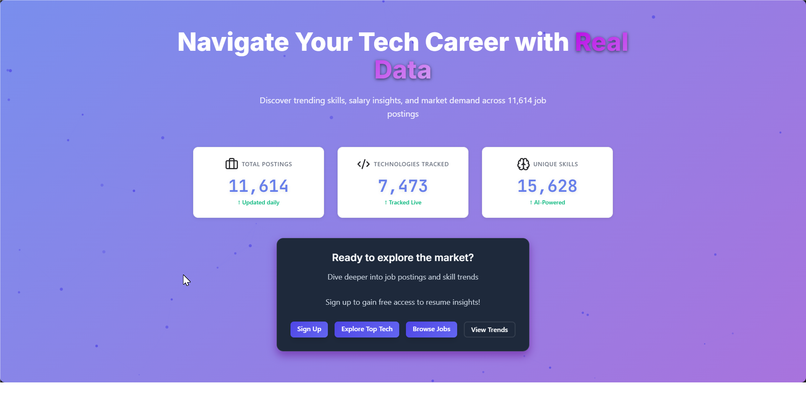
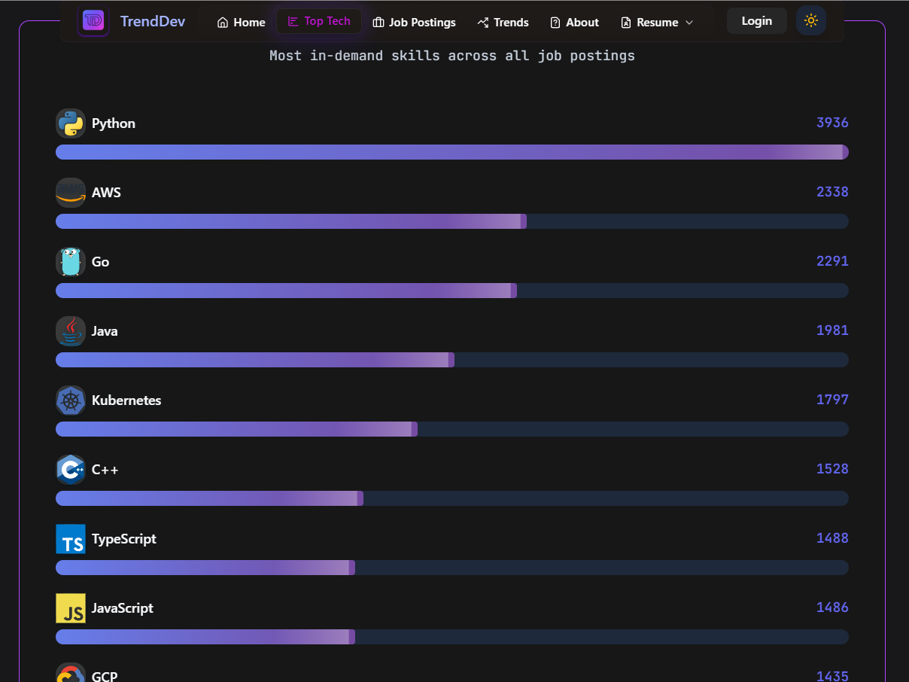
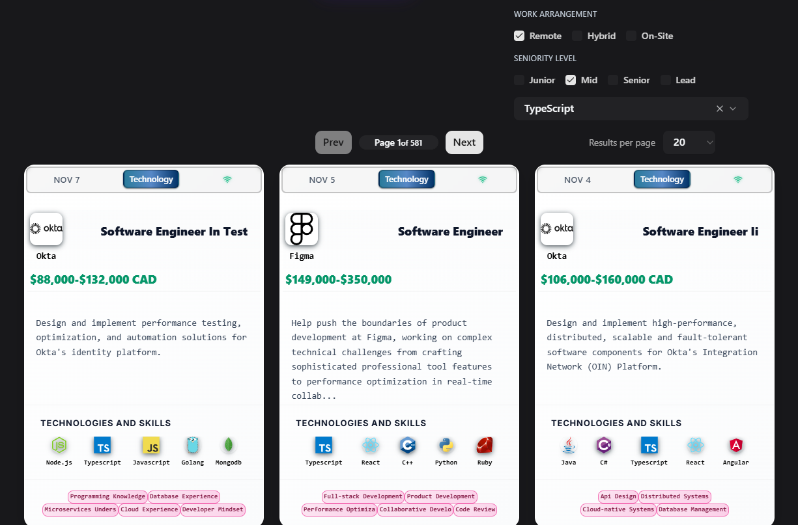
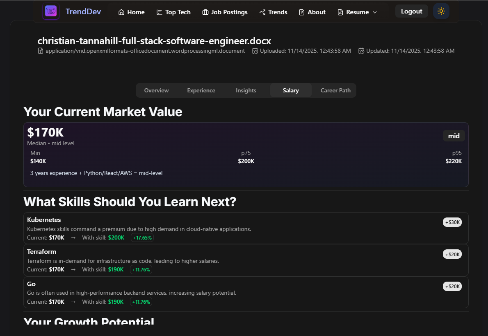
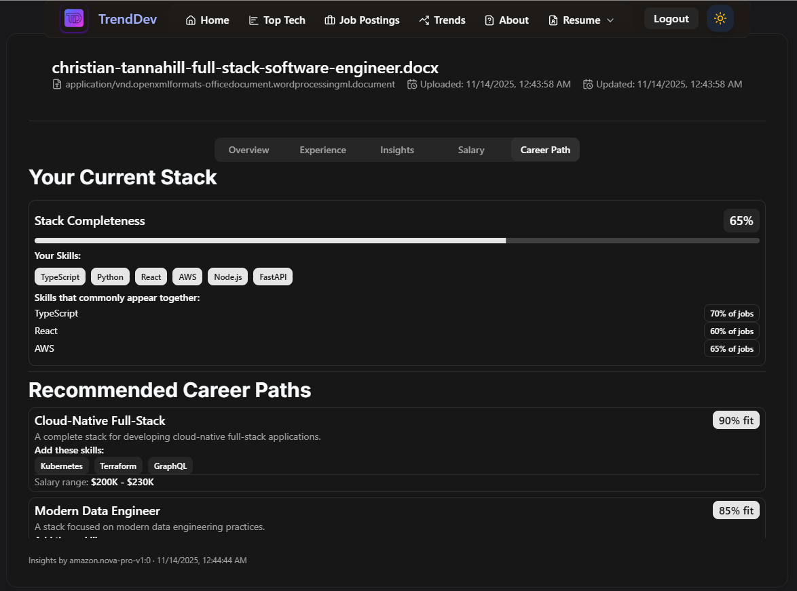
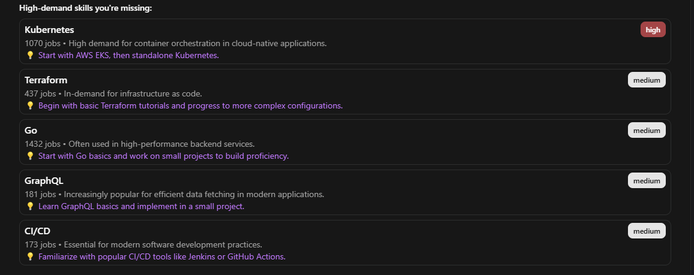
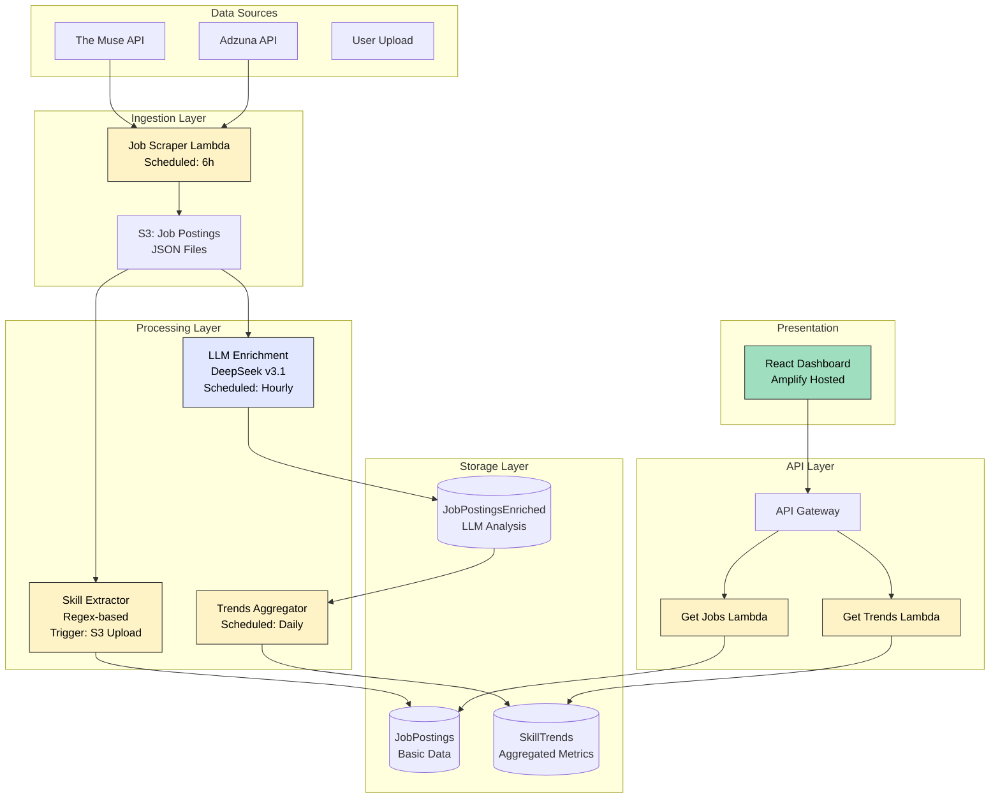
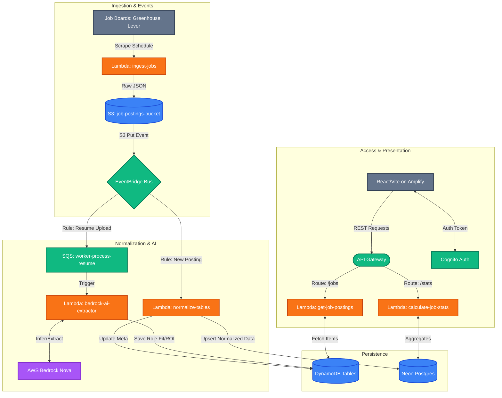

# TrendDev: Job Market Analyzer & AI Resume Screener

> **Project Context:** Architected and deployed a fully serverless AWS environment from scratch in a **7-day sprint** to learn the AWS ecosystem.
>
> _Note: The live application is currently offline following the expiration of the AWS trial environment, but the full architecture, source code, and visual demonstrations of the production build are preserved below._



TrendDev is an AI-powered platform designed to analyze real-time job market data. It tracks over 7,400 technologies across 11,000+ job postings, providing users with live demand scores, salary insights, and an AI-driven resume gap analysis.

## ⚙️ Tech Stack & Cloud Architecture

- **Cloud Infrastructure (AWS):** Lambda, API Gateway, DynamoDB, S3, EventBridge, Cognito, SQS
- **AI & Machine Learning:** AWS Bedrock (Nova Pro), DeepSeek v3.1, Textract
- **Frontend:** React, TypeScript, Vite, Tailwind CSS, shadcn/ui
- **Backend & Data:** Node.js, Neon Postgres, Prisma ORM
- **Deployment:** Serverless framework / SAM, GitHub Actions (CI/CD)

---

## 📊 Core Features & Visual Proof

### 1. Real-Time Market Demand & Job Filtering

The system continuously ingests job postings, utilizing a custom ETL pipeline to normalize titles and extract over 4,000 unique technologies. The frontend visualizes the most in-demand skills and allows users to filter live postings by tech stack, seniority, and remote status.




### 2. AI-Powered Resume Gap Analysis

Users can upload their resumes (PDF/DOCX) for AI extraction. The system compares the user's parsed experience against the live database of job requirements, calculating "Stack Completeness," identifying missing high-demand skills, and mapping realistic career progression paths based on real salary data.





---

## 🏗️ System Architecture

The application relies on a highly modular, event-driven microservices architecture to handle ingestion, AI enrichment, and client delivery.

### Complete System Pipeline


```mermaid
graph TB
    subgraph "Data Sources"
        Muse[The Muse API]
        Adzuna[Adzuna API]
        User[User Upload]
    end

    subgraph "Ingestion Layer"
        Scraper[Job Scraper Lambda<br/>Scheduled: 6h]
        S3Jobs[S3: Job Postings<br/>JSON Files]
    end

    subgraph "Processing Layer"
        RegexExtract[Skill Extractor<br/>Regex-based<br/>Trigger: S3 Upload]
        LLMEnrich[LLM Enrichment<br/>DeepSeek v3.1<br/>Scheduled: Hourly]
        Aggregator[Trends Aggregator<br/>Scheduled: Daily]
    end

    subgraph "Storage Layer"
        DBJobs[(JobPostings<br/>Basic Data)]
        DBEnriched[(JobPostingsEnriched<br/>LLM Analysis)]
        DBTrends[(SkillTrends<br/>Aggregated Metrics)]
    end

    subgraph "API Layer"
        API[API Gateway]
        GetJobs[Get Jobs Lambda]
        GetTrends[Get Trends Lambda]
    end

    subgraph "Presentation"
        Dashboard[React Dashboard<br/>Amplify Hosted]
    end

    Muse --> Scraper
    Adzuna --> Scraper
    Scraper --> S3Jobs
    S3Jobs --> RegexExtract
    S3Jobs --> LLMEnrich

    RegexExtract --> DBJobs
    LLMEnrich --> DBEnriched
    DBEnriched --> Aggregator
    Aggregator --> DBTrends

    Dashboard --> API
    API --> GetJobs
    API --> GetTrends
    GetJobs --> DBJobs
    GetTrends --> DBTrends

    classDef lambdaStyle fill:#fef3c7,stroke:#333,color:#000
    classDef llmStyle fill:#e0e7ff,stroke:#333,color:#000
    classDef frontendStyle fill:#9fdfbf,stroke:#333,color:#000

    class Scraper,RegexExtract,Aggregator,GetJobs,GetTrends lambdaStyle
    class LLMEnrich llmStyle
    class Dashboard frontendStyle
```

### Event-Driven Ingestion & AI Enrichment


```mermaid
graph TD
    classDef compute fill:#f97316,stroke:#c2410c,stroke-width:2px,color:white;
    classDef storage fill:#3b82f6,stroke:#1d4ed8,stroke-width:2px,color:white;
    classDef ai fill:#a855f7,stroke:#7e22ce,stroke-width:2px,color:white;
    classDef network fill:#10b981,stroke:#047857,stroke-width:2px,color:white;
    classDef external fill:#64748b,stroke:#334155,stroke-width:2px,color:white;

    subgraph Ingestion_Layer [Ingestion & Events]
        Sources[Job Boards: Greenhouse, Lever]:::external
        Scraper[Lambda: ingest-jobs]:::compute
        RawBucket[(S3: job-postings-bucket)]:::storage
        EB{EventBridge Bus}:::network
    end

    subgraph Processing_Layer [Normalization & AI]
        NormLambda[Lambda: normalize-tables]:::compute
        ResumeQueue[SQS: worker-process-resume]:::network
        AILambda[Lambda: bedrock-ai-extractor]:::compute
        Bedrock[AWS Bedrock Nova]:::ai
    end

    subgraph Storage_Layer [Persistence]
        Dynamo[(DynamoDB Tables)]:::storage
        Neon[(Neon Postgres)]:::storage
    end

    subgraph API_Layer [Access & Presentation]
        APIGW([API Gateway]):::network
        Auth[Cognito Auth]:::network
        StatsLambda[Lambda: calculate-job-stats]:::compute
        SearchLambda[Lambda: get-job-postings]:::compute
        Frontend[React/Vite on Amplify]:::external
    end

    Sources -->|Scrape Schedule| Scraper
    Scraper -->|Raw JSON| RawBucket
    RawBucket -->|S3 Put Event| EB

    EB -->|Rule: New Posting| NormLambda
    EB -->|Rule: Resume Upload| ResumeQueue

    NormLambda -->|Upsert Normalized Data| Neon
    NormLambda -->|Update Meta| Dynamo

    ResumeQueue -->|Trigger| AILambda
    AILambda <-->|Infer/Extract| Bedrock
    AILambda -->|Save Role Fit/ROI| Dynamo

    Frontend <-->|Auth Token| Auth
    Frontend -->|REST Requests| APIGW
    APIGW -->|Route: /stats| StatsLambda
    APIGW -->|Route: /jobs| SearchLambda

    StatsLambda <-->|Aggregates| Neon
    SearchLambda <-->|Fetch Items| Dynamo
```

---

## 🛠️ Developer Guide & Local Setup

### Repository Layout

This repository utilizes a centralized packaging architecture to manage numerous AWS Lambda functions alongside the React frontend.

- `lambda/` - Contains individual AWS Lambda function folders. Each includes a TypeScript source tree building to `dist/` and local package scripts.
- `frontend/` - React + Vite frontend (TypeScript + Tailwind + shadcn components).
- `zip.js` - Root-level packaging script that compiles target lambdas into `lambda.zip` for deployment.

### How to package a single lambda (local)

```bash
# from within a lambda folder (e.g. lambda/get-job-postings)
npm run build
# package using the root script
npm run package
# or call the root packer directly from repo root:
node zip.js lambda/get-job-postings
```

### Local Frontend Setup

Environment variables (`VITE_API_URL`) must be configured in `frontend/.env` to point to your deployed API Gateway.

```bash
cd frontend
npm install
npm run dev
```
